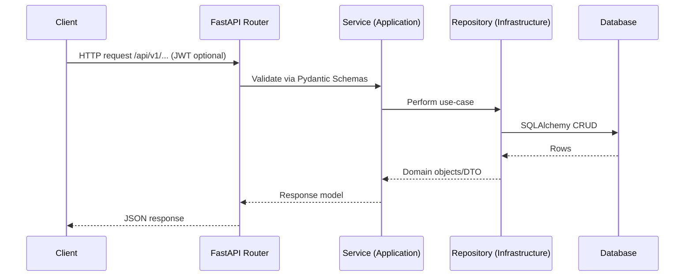
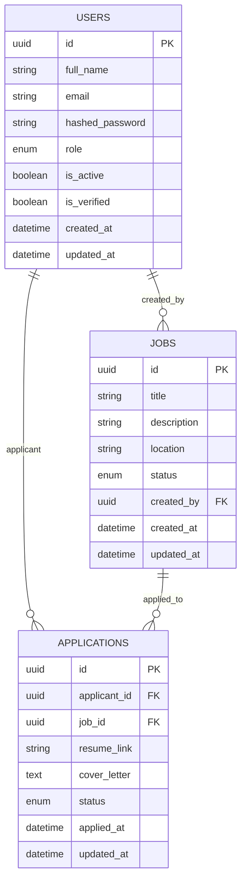

# Enterprise Job Board API (FastAPI, Clean Architecture)

A production-ready backend for a Job Board platform built with FastAPI, Pydantic, and SQLAlchemy, following Clean Architecture and SOLID principles. Includes JWT auth, RBAC-ready structure, Docker/Compose, and testing.

## 🎯 Overview

- **Purpose**: Manage users, jobs, and applications with clear layering and testability.
- **Principles**: Clean Architecture, SOLID, Repository/Service patterns, high cohesion, low coupling.
- **Status**: API v1 stable; suitable as a foundation for enterprise deployments.

## 🏗 Architecture

### Layered Architecture

```mermaid
graph TD
  A[Clients (Web/Mobile/3rd-party)] --> B[Interfaces Layer (FastAPI Routers)]
  B --> C[Application Layer (Services, Schemas, Use-Cases)]
  C --> D[Domain Layer (Entities, Business Rules)]
  C --> E[Infrastructure Layer (Repositories, DB, Integrations)]
  E --> F[(PostgreSQL/SQLite)]
  E --> G[(Redis)]
```

- **Interfaces**: `app/interfaces/api/v1` (routers, request mapping)
- **Application**: `app/application` (services, schemas, orchestration)
- **Domain**: `app/domain` (entities + business rules)
- **Infrastructure**: `app/infrastructure` (ORM models, repositories, DB config)

### Request Lifecycle



### Data Model (High-level)



### Deployment Topology

```mermaid
graph LR
  Dev[Developer] -->|docker-compose up| API[FastAPI App]
  API -->|SQLAlchemy| PG[(PostgreSQL)]
  API -->|Cache/Queues (optional)| REDIS[(Redis)]
  API -->|Health/Tracing (optional)| Sentry[Sentry]
```

## 📁 Repository Structure

```
app/
  core/                # config, security, exceptions, interfaces
  domain/              # entities and domain rules
  application/         # services and schemas
  infrastructure/      # DB, models, repositories
  interfaces/          # FastAPI routers and API
  main.py              # app factory and middleware
Dockerfile
docker-compose.yml
requirements.txt
tests/
```

## 🛠 Technology Stack

- **Framework**: FastAPI `0.104.1` on Starlette
- **Language**: Python 3.11+ (tested with 3.12)
- **ORM**: SQLAlchemy `2.0.x`
- **Validation**: Pydantic `2.x`
- **Auth**: JWT (python-jose), bcrypt hashing
- **Runtime**: Uvicorn
- **DevOps**: Docker, docker-compose
- **Quality**: black, isort, flake8, mypy, pytest, coverage
- **Optional**: Redis cache/queues, Sentry

## 📋 Prerequisites

- Python 3.11+ (recommended 3.12)
- pip
- Docker & docker-compose (for containerized runs)

## ⚙️ Configuration

Settings are managed via Pydantic Settings (`app/core/config.py`). Create `.env` in the project root:

```env
# Application
APP_NAME=Enterprise Backend
APP_VERSION=1.0.0
DEBUG=true
HOST=0.0.0.0
PORT=8000

# Database
DATABASE_URL=sqlite:///./enterprise_backend.db
DATABASE_ECHO=false

# Redis (optional)
REDIS_URL=redis://localhost:6379

# Security
SECRET_KEY=change-me-in-production
ALGORITHM=HS256
ACCESS_TOKEN_EXPIRE_MINUTES=30
REFRESH_TOKEN_EXPIRE_DAYS=7
PUBLIC_BASE_URL=http://localhost:8000

# CORS
ALLOWED_ORIGINS=["http://localhost:3000", "http://127.0.0.1:3000"]

# Email (optional)
SMTP_HOST=
SMTP_PORT=
SMTP_USER=
SMTP_PASSWORD=
SMTP_USE_TLS=true
FROM_EMAIL=no-reply@example.com

# Observability (optional)
SENTRY_DSN=
LOG_LEVEL=INFO
```

## 🚀 Run Locally

### Virtualenv

```bash
python -m venv venv
source venv/bin/activate  # Windows: venv\Scripts\activate
pip install -r requirements.txt
uvicorn app.main:app --reload --host 0.0.0.0 --port 8000
```

- Docs: `http://localhost:8000/docs`
- ReDoc: `http://localhost:8000/redoc`
- Health: `http://localhost:8000/health`

### Docker

```bash
# Build
docker build -t job-board-api .

# Run
docker run -p 8000:8000 --env-file .env job-board-api
```

### Docker Compose

```bash
docker-compose up --build
```

This starts:
- `app`: FastAPI server (`http://localhost:8000`)
- `db`: PostgreSQL 15
- `redis`: Redis 7

## 🔐 Security

- JWT-based auth with configurable expiry and algorithm
- Bcrypt password hashing
- CORS policy via settings
- Trusted hosts middleware
- Centralized exception handlers
- Secrets via environment variables

## 📚 API Notes

- Base path: `/api/v1`
- Explore endpoints in Swagger UI at `http://localhost:8000/docs`
- Authorization header: `Authorization: Bearer <token>`

## 🧪 Testing

```bash
pytest -q
pytest --cov=app
pytest tests/test_users.py -vv
```

## 🧹 Code Quality

```bash
black app/
isort app/
flake8 app/
mypy app/
```

## 🗄 Database

- Development defaults to SQLite; production should use PostgreSQL.
- SQLAlchemy engine is configured in `app/infrastructure/database/base.py`.
- Table creation happens on startup via `DatabaseManager.create_tables()`.
- For long-lived environments, consider migrations with Alembic.

### Migrations (Alembic) – optional

```bash
alembic init migrations
# Configure sqlalchemy.url in alembic.ini and target_meta in env.py
alembic revision -m "init"
alembic upgrade head
```

## 📦 Deployment

- Containerized via Docker; healthcheck at `/health`.
- Use `docker-compose.yml` for app + Postgres + Redis.
- For cloud deploys, set `SECRET_KEY`, `DATABASE_URL`, and CORS appropriately.
- Run with multiple workers behind a reverse proxy (e.g., `gunicorn -k uvicorn.workers.UvicornWorker`).

## 🔭 Observability

- Structured logging via `LOG_LEVEL` (extend with `structlog` if desired)
- Optional Sentry via `SENTRY_DSN`
- Add metrics endpoints or Prometheus client as needed

## 🚧 Roadmap (suggested)

- Refresh tokens and role-based authorization middleware
- Background jobs (email sending, indexing) using Redis/Celery
- Rate limiting and API keys for 3rd-party integrations
- Multi-tenant support and audit logging

## 🤝 Contributing

1. Fork & clone
2. Create a feature branch
3. Add tests and ensure `pytest` passes
4. Run formatters and linters
5. Open a Pull Request

## 📝 License

MIT (or your chosen license) 
